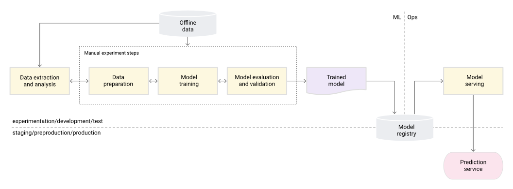
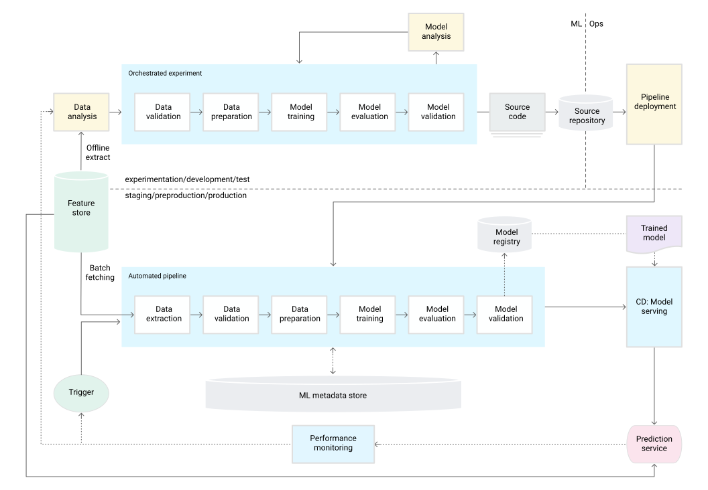
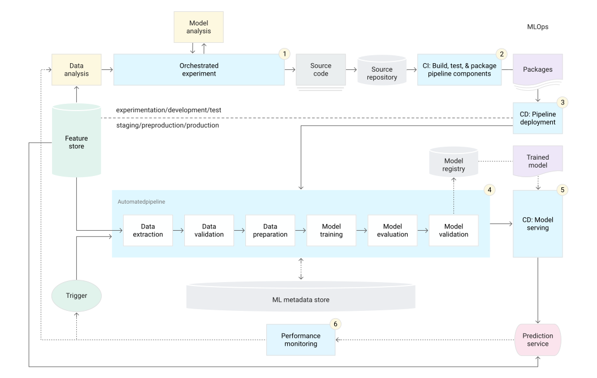
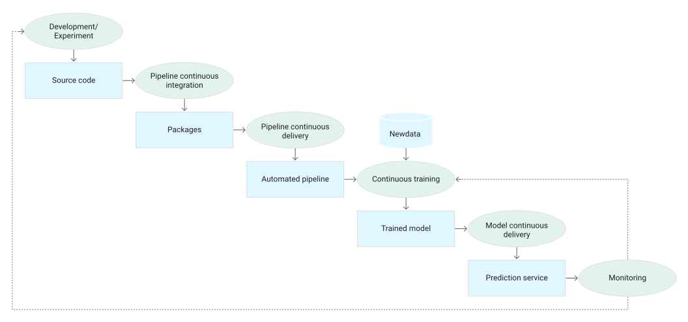

# MLOps: mognadsnivåer och automatiserade pipelines

## Förutsättningar för maskininlärning

Data science och maskininlärning används för att lösa komplexa problem inom många branscher och verksamhetsområden. Flera förutsättningar gör det möjligt att utveckla och använda maskininlärning i större skala:

- Stora datamängder.
- Beräkningsresurser som kan beställas vid behov, så kallade on-demand-resurser. Kostnaden beror på resursval, användning och arbetsbelastning; molnresurser är inte alltid billiga.
- Specialiserade acceleratorer för maskininlärning på olika molnplattformar.
- Snabb utveckling inom forskningsområden som datorseende, språkförståelse, generativ AI och rekommendationssystem.

Många företag investerar därför i sina data science-team och sin förmåga att utveckla maskininlärningssystem. Målet är att ta fram modeller som ger användarna och verksamheten ett konkret värde.

## Stegen från data till en modell i produktion

Ett ML-projekt börjar med att definiera verksamhetens problem, modellens användningsfall och kriterierna för ett lyckat resultat. Därefter omfattar vägen till produktion följande steg. Stegen kan genomföras manuellt eller köras i en automatiserad pipeline.

### 1. Datautvinning

Man väljer ut och sammanför relevanta data från olika datakällor för den aktuella maskininlärningsuppgiften.

### 2. Dataanalys

Man gör en utforskande dataanalys, EDA, som står för *exploratory data analysis*. Syftet är att förstå vilka data som finns och hur de kan användas för att bygga modellen.

Analysen ger underlag för att förstå dataschemat och datans egenskaper, till exempel vilka kolumner, datatyper och fördelningar som finns. Den hjälper också till att identifiera vilken dataförberedelse och feature engineering som behövs. Feature engineering innebär att skapa eller bearbeta de variabler som modellen använder som indata, så kallade features.

### 3. Dataförberedelse

Data förbereds för maskininlärningsuppgiften. Arbetet omfattar datarensning, uppdelning i tränings-, validerings- och testdata samt de datatransformationer och den feature engineering som uppgiften kräver. Datarensning och uppdelning är olika arbetsmoment: datarensning kan exempelvis innebära att hantera saknade eller felaktiga värden.

Uppdelningen måste passa användningsfallet. Transformationer som lär sig något från data, exempelvis medelvärden för skalning, ska normalt anpassas på träningsdata och sedan användas på validerings- och testdata. Annars kan information från utvärderingsdata läcka in i träningen och ge en missvisande bild av modellens kvalitet.

Resultatet är förberedda datamängder som kan användas i de efterföljande stegen.

### 4. Modellträning

Data scientists använder förberedda data för att träna och jämföra modeller med olika algoritmer. De kan också justera hyperparametrar, exempelvis inlärningshastighet eller träddjup, för att hitta en väl fungerande konfiguration.

Modellval och hyperparameterjustering görs med stöd av valideringsdata eller en lämplig korsvalidering, så att testdata kan hållas separat för den slutliga utvärderingen. Resultatet av träningssteget är en tränad modell.

### 5. Modellutvärdering

Modellen utvärderas på separat testdata för att bedöma dess prediktiva kvalitet. Resultatet är utvärderingsmått, eller metrics, som beskriver hur modellen presterar. Vilka mått som är relevanta beror på uppgiften; träffsäkerhet är inte ett lämpligt eller tillräckligt mått i alla användningsfall.

### 6. Modellvalidering

Man kontrollerar att modellen uppfyller kraven för driftsättning. Det kan bland annat innebära att jämföra dess prediktiva kvalitet med en baslinje och med den modell som redan används i produktion.

Utvärdering beskriver alltså modellens resultat, medan validering handlar om att avgöra om resultaten och övriga egenskaper är tillräckliga för att modellen ska få användas.

### 7. Driftsättning för prediktioner

Den validerade modellen driftsätts i en målmiljö där den kan användas för prediktioner. Det kan exempelvis ske som:

- En mikrotjänst med ett REST-API för prediktioner på begäran, så kallade onlineprediktioner.
- En inbyggd modell på en edge-enhet eller mobil enhet.
- En del av ett system för batchprediktioner, där många dataposter bearbetas tillsammans.

*Model serving* avser att göra modellen tillgänglig och köra den för att ge prediktioner. Driftsättning är steget där modellen förs in i den miljö där detta ska ske.

### 8. Modellövervakning

Modellens beteende och prediktiva kvalitet övervakas i produktion. Resultaten kan visa att en ny iteration av ML-processen behövs. Att mäta prediktiv kvalitet kräver ofta att korrekta utfall blir tillgängliga, vilket kan ske först efter en fördröjning.

Hur mycket av processen som automatiseras beskriver dess mognadsnivå i den modell som används här. Automatisering påverkar hur snabbt och tillförlitligt teamet kan träna och leverera nya modellversioner när nya data eller nya implementationer finns. Det engelska ordet *velocity* syftar här på takten i det arbetet, inte enbart på hur snabbt själva träningen körs.

## MLOps nivå 0: manuell process

På nivå 0 kan teamet ha data scientists och ML-forskare som bygger avancerade modeller, samtidigt som arbetet med att träna och driftsätta modellerna huvudsakligen sker manuellt. Detta är den grundläggande mognadsnivån i artikelns indelning.

### Kännetecken

**Manuell, skriptbaserad och interaktiv process.** Dataanalys, dataförberedelse, modellträning och validering startas manuellt. Även övergångarna mellan stegen hanteras manuellt. Arbetet drivs ofta av experimentell kod som skrivs och körs i notebooks tills teamet har en modell som fungerar för uppgiften.

**Åtskillnad mellan modellutveckling och drift.** Data scientists skapar modellen och lämnar över den som en artefakt till ett team som ansvarar för driftsättningen. En artefakt är ett sparat resultat från ett arbetssteg, exempelvis en modellfil. Överlämningen kan ske genom att lägga modellen på en lagringsplats, checka in modellobjektet i ett kodarkiv eller registrera modellen i ett modellregister. Vilken lagringslösning som är lämplig beror bland annat på modellens storlek och kraven på versionering.

Driftteamet behöver därefter göra modellens features tillgängliga i produktion med tillräckligt kort svarstid. Om träning och prediktion använder olika beräkningslogik eller olika representationer av features kan det uppstå *training-serving skew*: skillnader mellan de data eller den bearbetning som modellen tränades med och det den möter när den används. Exempelvis kan träningen ha hanterat saknade värden på ett sätt, medan prediktionstjänsten hanterar dem på ett annat. Modellen kan då ge sämre resultat trots att modellfilen är densamma.

**Sällan förekommande modellsläpp.** Upplägget passar framför allt ett mindre antal modeller som sällan behöver ändrad implementation eller omträning. En ny modellversion kan exempelvis driftsättas bara några gånger per år.

**Ingen automatiserad CI för ML-arbetsflödet.** Kodtestning görs ofta när notebooks eller skript körs. Koden kan fortfarande vara versionshanterad och producera artefakter som tränade modeller, utvärderingsmått och visualiseringar. Versionshantering innebär alltså inte i sig att kontinuerlig integration, CI, finns på plats.

**Ingen automatiserad CD för ML-arbetsflödet.** Eftersom modellsläppen är få har teamet inte byggt ett automatiserat flöde för kontinuerlig leverans av nya modellversioner eller träningspipelines.

**Driftsättningen gäller prediktionstjänsten.** Teamet driftsätter den färdigtränade modellen, exempelvis som en mikrotjänst med ett REST-API. Det är inte en hel automatiserad träningspipeline som driftsätts.

**Brist på aktiv övervakning av modellkvalitet.** Prediktioner och efterföljande åtgärder följs inte upp tillräckligt för att upptäcka försämrad prediktiv kvalitet eller andra förändringar i modellens beteende.

Teamet som driver API-tjänsten kan ändå ha ett avancerat upplägg för konfigurering, säkerhet, testning och driftsättning. Det kan omfatta regressionstester, belastningstester och canary-tester. Vid en canary-driftsättning får en begränsad del av trafiken använda den nya versionen innan den används bredare. En modellversion kan också utvärderas genom A/B-testning eller andra experiment i produktion innan den får hantera all prediktionstrafik. Nivå 0 beskriver alltså ML-processens automatisering, inte nödvändigtvis all programvaruutveckling i organisationen.

### Utmaningar

En manuell process kan räcka när modeller sällan ändras eller behöver tränas om. Problem kan däremot uppstå när förhållandena i produktion skiljer sig från träningsmiljön eller förändras över tid. En modell anpassar sig inte automatiskt till sådana förändringar bara för att den är driftsatt. Koden kan fortsätta fungera samtidigt som prediktionerna blir mindre användbara.

För att hantera detta behöver teamet aktivt övervaka modellens kvalitet i produktion. Övervakningen kan upptäcka försämringar och ge en signal om att nya experiment eller omträning behöver övervägas. Att modellen blivit *stale* innebär i det här sammanhanget att den inte längre är tillräckligt aktuell för de förhållanden där den används; ”inaktuell” är därför en bättre beskrivning än ”stel”.

Omträning med nyare, relevanta data kan behövas för att fånga nya eller förändrade mönster. Ett rekommendationssystem för modeprodukter kan exempelvis behöva anpassas till nya produkter och trender. Hur ofta omträning behövs beror på användningsfallet och resultaten från övervakningen. Alla modeller behöver inte tränas om ofta.

Teamet behöver också kunna prova förbättringar i feature engineering, modellarkitektur och hyperparametrar. Även när själva uppgiften är relativt stabil, exempelvis att upptäcka ansikten i bilder, kan nya metoder ge bättre resultat.

En automatiserad träningspipeline kan möjliggöra kontinuerlig träning, CT. Ett CI/CD-system kan dessutom automatisera testning, bygge och driftsättning av nya implementationer av pipelinen. Dessa är två närliggande men olika delar av automatiseringen.

## MLOps nivå 1: automatiserad ML-pipeline

På nivå 1 automatiseras träningspipelinen så att modeller kan tränas om med nya data och godkända modellversioner kan driftsättas automatiskt. Detta möjliggör kontinuerlig träning och leverans av nya modellversioner till prediktionstjänsten.

Kontinuerlig träning betyder inte att träningen pågår utan avbrott. Pipelinen körs när en bestämd utlösande händelse, en trigger, inträffar. För att detta ska fungera behövs automatiserad data- och modellvalidering, regler för när pipelinen ska starta samt metadatahantering.

### Kännetecken

**Snabbare experiment.** Experimentens steg orkestreras, det vill säga körs i rätt ordning med hanterade beroenden. Övergångarna mellan stegen automatiseras. Det gör det lättare att upprepa experiment och förbereda pipelinen för produktion.

**Kontinuerlig träning i produktion.** Modellen tränas automatiskt med nya data när någon av de definierade utlösande händelserna inträffar.

**Samma pipelineimplementation i experiment och drift.** Den implementation som används i utvecklings- och experimentmiljön används också i förproduktions- och produktionsmiljön. Miljöernas konfigurering och data kan skilja sig, men teamet undviker att skriva om hela träningsflödet när det ska tas i drift. Detta brukar beskrivas som symmetri mellan experiment och drift.

**Modulär kod för komponenter och pipelines.** Komponenterna behöver vara återanvändbara och möjliga att kombinera till olika pipelines. Det är innebörden av *composable*: en komponent har ett tydligt ansvar och tydliga in- och utdata, så att den kan kopplas ihop med andra komponenter. Exempelvis kan en datavalideringskomponent återanvändas i flera träningsflöden. EDA kan fortfarande göras i notebooks, medan kod för återkommande pipelinesteg organiseras i moduler.

Komponenterna kan med fördel paketeras i containrar för att:

- Skilja den underliggande infrastrukturen från komponentens specifika körmiljö. En container paketerar kod och beroenden så att samma komponent kan köras på kompatibla värdsystem utan att alla dess bibliotek behöver installeras direkt på varje värd.
- Ge mer enhetliga körmiljöer i utveckling och produktion. Detta underlättar reproducerbarhet, men garanterar inte i sig identiska resultat.
- Isolera komponenternas körmiljöer. Olika steg kan då använda olika språk, bibliotek och biblioteksversioner.

**Kontinuerlig leverans av modeller.** När pipelinen har tränat och validerat en ny modellversion kan ett automatiserat driftsättningssteg göra den tillgänglig i prediktionstjänsten.

**Driftsättning av träningspipelinen.** På nivå 0 driftsätts framför allt den färdigtränade modellen. På nivå 1 driftsätts också träningspipelinen, som sedan kan köras återkommande och producera nya modellversioner. Själva införandet av en ändrad pipelineimplementation kan fortfarande ske manuellt.

### Tilläggskomponenter

#### Data- och modellvalidering

När en trigger startar pipelinen används tillgängliga träningsdata för att producera en ny modellversion. Det behöver inte vara en realtidsström; data kan exempelvis komma från en databas eller en batchleverans. Automatiserade kontroller behövs för att avgöra om data kan användas och om den nya modellen får driftsättas.

**Datavalidering** sker före modellträningen. Pipelinen kontrollerar bland annat följande:

- **Schemaavvikelser, data schema skews.** Data överensstämmer inte med det förväntade schemat. Exempel är saknade eller oväntade features, fel datatyper eller värden som bryter mot definierade krav. Pipelinen bör stoppa eller avvisa data som inte klarar de kontroller som krävs för säker bearbetning. Teamet får undersöka orsaken och vid behov ändra datakällan eller pipelinen.
- **Fördelningsavvikelser, data value skews.** Datans statistiska egenskaper har förändrats betydligt jämfört med en referens. Det kan betyda att modellen behöver tränas om, men det kan också bero på ett fel i datainsamlingen. Förändringen behöver därför bedömas enligt systemets regler innan omträning startas.

*Skew* översätts här lämpligast med ”avvikelse” eller ”skillnad”, beroende på sammanhanget. Det handlar inte nödvändigtvis om statistisk skevhet i betydelsen en asymmetrisk fördelning.

**Modellvalidering** sker efter träningen och före godkännande för produktion. Den omfattar att:

- Beräkna relevanta utvärderingsmått på separat utvärderingsdata för att bedöma modellens prediktiva kvalitet.
- Jämföra resultatet med en baslinje, den aktuella produktionsmodellen och verksamhetens krav. Modellen ska klara fastställda godkännandekriterier; det räcker inte att ett enskilt mått ser bättre ut.
- Undersöka kvaliteten för relevanta delar av datan. En modell som förutsäger kundbortfall kan exempelvis prestera bättre totalt men sämre för kunder i en viss region. Målet är att upptäcka oacceptabla skillnader, inte att kräva exakt samma resultat i varje grupp.
- Kontrollera att modellen är kompatibel med infrastrukturen och prediktionstjänstens API.

Offlinevalideringen kan följas av validering i produktion, exempelvis genom en canary-driftsättning eller ett A/B-test, innan modellen används för all trafik.

#### Feature store

En feature store är en valfri komponent som samlar definitioner, lagring och åtkomst till features för träning och prediktioner. Namnet används ofta även på svenska. Syftet är att olika delar av systemet ska kunna återanvända features med gemensamma definitioner.

En feature store som används för både batchbearbetning och realtidsprediktioner behöver stödja båda typerna av åtkomst. *High throughput* betyder hög genomströmning: att kunna läsa eller leverera stora mängder featurevärden per tidsenhet. Låg latens betyder kort svarstid för en enskild förfrågan. Träning kan kräva stora datamängder, medan en prediktionstjänst ofta behöver ett mindre antal värden snabbt.

En feature store hjälper teamet att:

- Hitta och återanvända befintliga uppsättningar av features för relevanta entiteter, exempelvis kunder eller produkter.
- Undvika flera snarlika features med olika definitioner genom att förvalta definitioner och tillhörande metadata.
- Tillgängliggöra aktuella featurevärden för prediktioner.
- Minska risken för training-serving skew genom gemensamma definitioner och konsekvent bearbetning vid träning och prediktion.

Vid experiment kan data scientists hämta ett offlineuttag för analys och modellträning. Vid kontinuerlig träning kan pipelinen hämta relevanta featurevärden i batch. Vid onlineprediktion hämtar tjänsten värden för den entitet som förfrågan gäller, exempelvis kundens egenskaper, produktinformation eller sammanställd information om den aktuella sessionen.

Om förfrågan gäller en kund kan relevanta features exempelvis vara ålder, köphistorik och beteende på webbplatsen. Tjänsten kan hämta flera behövliga featurevärden i en samlad förfrågan i stället för att göra separata anrop för varje värde. Detta kan minska antalet anrop och effektivisera hämtningen.

Gemensamma featuredefinitioner betyder inte att träning och prediktion alltid ska använda samma aktuella värden. Historiska träningsdata behöver värden som stämmer med den tidpunkt som respektive datapost avser. En feature store undanröjer därför inte automatiskt alla skillnader eller all risk för dataläckage.

#### Metadatahantering

Information om varje pipelinekörning sparas för att stödja reproducerbarhet, jämförelser och felsökning. Informationen ger också spårbarhet, eller *lineage*: hur data och artefakter hänger ihop, vilka steg som skapade dem och vilka versioner och indata som användes.

Ett metadatalager för ML kan registrera:

- Versionerna av pipelinen och de komponenter som kördes.
- Start- och sluttider samt hur lång tid varje steg tog att slutföra.
- Vem eller vilket system som startade körningen.
- Parametervärdena som skickades till pipelinen.
- Referenser till artefakterna från varje steg, exempelvis förberedda data, upptäckta valideringsavvikelser, beräknad statistik och listor över kategorier som extraherats från kategoriska features.
- Referenser till tidigare modellversioner för återgång, rollback, eller för jämförelser med en ny modellversion.
- Utvärderingsmått för modellen på tränings- och testdata, så att resultat kan följas upp och jämföras mellan körningar.

Referenser till sparade mellanresultat kan göra det möjligt att återuppta en misslyckad körning utan att köra om redan slutförda steg. Det förutsätter att orkestreraren stöder detta och att resultaten fortfarande är giltiga. Metadata i sig utför inte återstarten.

Vid jämförelse av modeller behöver man också kontrollera vilka data utvärderingen bygger på. Mått från olika testmängder är inte alltid direkt jämförbara.

#### Utlösande händelser för ML-pipelinen

Pipelinen kan startas på flera sätt, beroende på användningsfallet:

- **På begäran, on demand.** En person startar en körning när den behövs, utan att invänta ett schema. *Ad hoc* betyder här att körningen görs för ett aktuellt behov. De efterföljande pipelinestegen kan fortfarande vara automatiserade.
- **Enligt ett schema.** Körningen startar exempelvis dagligen, veckovis eller månadsvis när nya data med tillhörande etiketter eller utfall finns. Frekvensen beror på hur ofta relevanta mönster förändras och vad omträningen kostar.
- **När nya träningsdata finns.** Körningen startar när en ny datamängd har samlats in och gjorts tillgänglig. Detta passar när data kommer oregelbundet snarare än enligt ett fast schema.
- **När modellens kvalitet försämras.** Uppmätt försämring kan starta en omträningsprocess, om det finns lämpliga data och systemets regler tillåter det.
- **När datans fördelningar förändras betydligt.** Ändrade fördelningar hos modellens indata kan vara en tidig varningssignal, särskilt när korrekta utfall ännu inte finns för att mäta prediktionskvaliteten. Förändringen visar däremot inte i sig att modellen har försämrats eller måste tränas om.

Förändrade fördelningar i indata brukar kallas *data drift*. *Concept drift* avser förändringar i sambandet mellan indata och det utfall som modellen ska förutsäga. Begreppen är närliggande men betyder inte samma sak.

### Utmaningar på nivå 1

När teamet bara hanterar ett fåtal pipelines och sällan ändrar deras implementation kan testning och driftsättning av själva pipelinekoden fortfarande ske manuellt. Ett IT- eller driftteam kan få den testade koden och installera den i målmiljön. Den driftsatta pipelinen tränar sedan nya modeller automatiskt med nya data.

Detta passar framför allt när nya modellversioner kommer från uppdaterade träningsdata snarare än från täta förändringar i träningskoden. Skillnaden är viktig: automatiserad omträning av en befintlig pipeline innebär inte att leveransen av ändrad pipelinekod också är automatiserad.

När teamet behöver prova nya ML-idéer och ofta ändra komponenterna, eller hantera många pipelines, blir ett CI/CD-system för bygge, testning och leverans av pipelineimplementationerna användbart.

## MLOps nivå 2: automatiserad CI/CD för pipelines

På nivå 2 finns ett automatiserat CI/CD-system för att bygga, testa och leverera ändrade pipelineimplementationer. Det kompletterar den automatiserade träningen och modellleveransen från nivå 1.

Data scientists och utvecklare kan prova nya idéer inom feature engineering, modellarkitektur och hyperparametrar. När koden ändras kan systemet automatiskt testa och paketera de nya komponenterna och leverera dem enligt organisationens regler för godkännande och driftsättning.

### Komponenter

Artikelns exempel på arkitektur innehåller följande komponenter:

- Versionshantering av källkod.
- Tjänster för testning och bygge.
- Tjänster för driftsättning.
- Ett modellregister för registrering och hantering av modellversioner.
- En feature store.
- Ett metadatalager för ML.
- En orkestrerare som styr körningen av ML-pipelinen.

Det är ett exempel på en arkitektur, inte ett krav på att varje system måste ha separata produkter för samtliga komponenter. En feature store är inte ett generellt krav för att automatisera CI/CD.

### Stegen i det automatiserade flödet

1. **Utveckling och experiment.** Teamet provar algoritmer och modeller i ett orkestrerat experimentflöde. Resultatet är källkod för pipelinestegen som skickas till ett kodarkiv.
2. **Kontinuerlig integration av pipelinen.** Koden byggs och testas. Resultatet är paketerade komponenter, exempelvis programvarupaket, körbara filer och andra artefakter, som kan driftsättas senare.
3. **Kontinuerlig leverans av pipelinen.** Artefakterna från CI-steget levereras till målmiljön. Resultatet är en driftsatt pipeline med den uppdaterade implementationen av träningsflödet. Det är ännu inte nödvändigtvis en ny färdigtränad modell.
4. **Automatisk start av träningspipelinen.** Pipelinen körs enligt ett schema eller som svar på en annan trigger. Resultatet är en tränad modellversion som registreras i modellregistret. Valideringskontroller avgör om den får gå vidare till driftsättning.
5. **Kontinuerlig leverans av modeller.** En godkänd modellversion görs tillgänglig för prediktioner. Resultatet är en driftsatt prediktionstjänst med den nya modellen.
6. **Övervakning.** Systemet samlar information om modellens beteende och kvalitet med data från produktion. Resultaten kan utlösa en ny pipelinekörning eller ge underlag för en ny experimentcykel.

Utforskande dataanalys och analys av modellresultat görs fortfarande av människor i det beskrivna upplägget. Automatiseringen ersätter alltså inte behovet av att undersöka data, tolka resultat och bedöma vilka ändringar som är motiverade.

### Kontinuerlig integration, CI

Pipelinen och dess komponenter byggs, testas och paketeras när kodändringar utlöser CI-flödet, exempelvis vid en push eller en pull request. En lokal commit startar inte i sig en fjärrbaserad CI-körning; det beror på vilka händelser systemet är konfigurerat att reagera på.

Utöver att skapa paket, containeravbildningar och körbara filer kan CI omfatta följande tester:

- Enhetstester av logiken för feature engineering.
- Enhetstester av modellens och databearbetningens funktioner. Ett exempel är att kontrollera att en funktion kodar en kategorisk kolumn korrekt med one-hot-kodning. Då representeras kategorierna av indikatorer som visar vilken kategori en datapost tillhör.
- Ett begränsat träningstest som kontrollerar att förlustvärdet, loss, kan minska. Ett vanligt felsökningstest är att försöka överanpassa modellen på ett mycket litet antal exempel. Om modellen inte ens kan lära sig dessa kan något vara fel i träningskedjan. Testet visar däremot inte att modellen generaliserar väl till nya data eller att en fullständig träning har konvergerat.
- Kontroller av att träningen inte producerar NaN eller andra icke-finita värden. NaN betyder *Not a Number* och kan uppstå vid ogiltiga numeriska operationer. Division med noll kan, beroende på operation och bibliotek, ge ett undantag, oändlighet eller NaN. Mycket stora eller små värden kan också orsaka numeriska problem.
- Tester av att varje komponent producerar de förväntade artefakterna.
- Integrationstester av att komponenterna fungerar tillsammans.

### Kontinuerlig leverans, CD

Systemet levererar nya pipelineimplementationer till målmiljön. Den uppdaterade pipelinen kan sedan träna och leverera nya modeller. För en tillförlitlig leverans behöver teamet överväga följande:

- **Kompatibilitet med målmiljön.** Kontrollera att modellens bibliotek och andra beroenden finns och är kompatibla, samt att tillräckligt med minne, beräkningskapacitet och eventuella acceleratorer är tillgängliga.
- **Testning av prediktionstjänstens API.** Skicka förväntade indata och kontrollera svarens struktur och innehåll enligt definierade krav. Detta kan fånga problem när en ny modellversion exempelvis förväntar sig andra indata.
- **Belastningstestning.** Mät tjänstens kapacitet och svarstider. QPS, *queries per second*, är antalet förfrågningar per sekund. Latens är tiden det tar att besvara en förfrågan; modellens beräkningstid och hela tjänstens svarstid kan behöva mätas separat.
- **Datavalidering.** Kontrollera data som ska användas för omträning eller batchprediktioner.
- **Kontroll av modellkvalitet.** Verifiera att modellen uppfyller kraven på prediktiv kvalitet innan den driftsätts.
- **Automatisk driftsättning till testmiljö.** Ett exempel är att en push till en utvecklingsgren startar driftsättningen.
- **Delvis automatiserad driftsättning till förproduktionsmiljö.** Ett exempel är att kodgranskare först godkänner ändringarna och att en sammanslagning till huvudgrenen sedan startar driftsättningen automatiskt.
- **Godkänd driftsättning till produktion.** I artikelns exempel sker detta manuellt efter flera lyckade pipelinekörningar i förproduktionsmiljön. Det är ett möjligt upplägg, inte ett krav på en viss grennamnstandard eller ett visst antal körningar.

CD används både om *continuous delivery*, kontinuerlig leverans, och *continuous deployment*, kontinuerlig driftsättning. Vid kontinuerlig leverans hålls testade ändringar redo för driftsättning, men ett manuellt produktionsgodkännande kan finnas kvar. Vid kontinuerlig driftsättning går godkända ändringar automatiskt vidare till produktion. En manuell godkännandepunkt är därför förenlig med ett i övrigt automatiserat CI/CD-system.

## Att utveckla automatiseringen stegvis

Att använda ML i produktion kan omfatta mer än att exponera en färdig modell genom ett API. När användningsfallet kräver återkommande omträning kan en träningspipeline automatisera arbetet med att skapa, validera och driftsätta nya modellversioner. Ett CI/CD-system automatiserar i sin tur testning och leverans av ändringar i själva pipelineimplementationen.

Denna uppdelning hjälper teamet att hantera både förändrade data och nya idéer i modellutvecklingen. Alla system behöver inte den högsta automatiseringsnivån, och hela processen behöver inte flyttas till en ny nivå på en gång. Arbetssätten kan införas stegvis utifrån användningsfallet, förändringstakten och kraven på tillförlitlighet.